# MagOneAI Authentication System Design

## Table of Contents
1. [System Overview](#system-overview)
2. [Database Schema](#database-schema)
3. [User & Organization Model](#user--organization-model)
4. [Permissions & Roles](#permissions--roles)
5. [API Keys & Secrets](#api-keys--secrets)
6. [Usage Tracking & Limits](#usage-tracking--limits)
7. [Authentication Flows](#authentication-flows)
8. [API Architecture](#api-architecture)

---

## System Overview

### Complete Architecture

```
┌─────────────────────────────────────────────────────────────────────────────┐
│                           MAGONEAI AUTH SYSTEM                               │
├─────────────────────────────────────────────────────────────────────────────┤
│                                                                             │
│  ┌─────────────────────────────────────────────────────────────────────┐   │
│  │                         ORGANIZATIONS                                │   │
│  │  Users can belong to multiple orgs with different roles              │   │
│  │  Resources can be personal OR shared within an org                   │   │
│  └─────────────────────────────────────────────────────────────────────┘   │
│                                    │                                        │
│          ┌─────────────────────────┼─────────────────────────┐             │
│          ▼                         ▼                         ▼             │
│  ┌──────────────┐         ┌──────────────┐         ┌──────────────┐        │
│  │    USERS     │         │  ORG_MEMBERS │         │  RESOURCES   │        │
│  │──────────────│         │──────────────│         │──────────────│        │
│  │ email        │         │ user_id      │         │ agents       │        │
│  │ password     │         │ org_id       │         │ workflows    │        │
│  │ role         │         │ org_role     │         │ mcp_servers  │        │
│  │ permissions  │         │              │         │ knowledge    │        │
│  └──────────────┘         └──────────────┘         └──────────────┘        │
│          │                                                │                 │
│          │              ┌─────────────────────────────────┘                 │
│          ▼              ▼                                                   │
│  ┌─────────────────────────────────────────────────────────────────────┐   │
│  │                         OWNERSHIP MODEL                              │   │
│  │                                                                      │   │
│  │  Resource can be owned by:                                           │   │
│  │  • user_id (personal) - only that user can access                   │   │
│  │  • org_id (shared) - all org members can access based on role       │   │
│  └─────────────────────────────────────────────────────────────────────┘   │
│                                                                             │
│  ┌─────────────────────────────────────────────────────────────────────┐   │
│  │                         AUTHENTICATION                               │   │
│  │                                                                      │   │
│  │  • JWT Tokens (web login)     - 15 min access, 7 day refresh        │   │
│  │  • Platform API Keys          - for scripts/automation              │   │
│  │  • OAuth (Google, GitHub)     - social login                        │   │
│  └─────────────────────────────────────────────────────────────────────┘   │
│                                                                             │
│  ┌─────────────────────────────────────────────────────────────────────┐   │
│  │                         USER SECRETS                                 │   │
│  │                                                                      │   │
│  │  • LLM Provider Keys (OpenAI, Anthropic) - encrypted per user       │   │
│  │  • Each user provides their own keys, pays their own bills          │   │
│  └─────────────────────────────────────────────────────────────────────┘   │
│                                                                             │
│  ┌─────────────────────────────────────────────────────────────────────┐   │
│  │                         USAGE TRACKING                               │   │
│  │                                                                      │   │
│  │  • API calls per user/org                                           │   │
│  │  • Workflow executions                                              │   │
│  │  • Token usage (LLM calls)                                          │   │
│  │  • Configurable limits per user/org                                 │   │
│  └─────────────────────────────────────────────────────────────────────┘   │
│                                                                             │
└─────────────────────────────────────────────────────────────────────────────┘
```

---

### Key Concepts

| Concept | Description |
|---------|-------------|
| **User** | Individual account with email/password or OAuth |
| **Organization** | Group of users who share resources |
| **Org Member** | Links user to org with a role (owner/admin/member) |
| **Personal Resource** | Owned by user_id, only that user can access |
| **Shared Resource** | Owned by org_id, all org members can access |
| **Platform API Key** | For accessing MagOneAI from scripts |
| **User Secret** | Encrypted LLM keys (OpenAI, Anthropic) per user |
| **Usage** | Track API calls, workflow runs, token usage |
| **Limits** | Configurable caps per user or org |

---

### Two Types of API Keys

```
┌─────────────────────────────────────────────────────────────────────┐
│                         KEY TYPES                                    │
├─────────────────────────────────────────────────────────────────────┤
│                                                                     │
│  1. PLATFORM API KEYS (for accessing MagOneAI)                      │
│     Purpose: Let users access OUR platform from code/scripts        │
│     Example: mag_sk_abc123...                                       │
│     Stored: Hashed in api_keys table                                │
│     Used by: Python scripts, automation, external apps              │
│                                                                     │
│  2. LLM PROVIDER KEYS (user's own OpenAI/Anthropic keys)            │
│     Purpose: Let user's agents call OpenAI, Anthropic, etc.         │
│     Example: sk-proj-abc123... (OpenAI)                             │
│     Stored: Encrypted in user_secrets table (per user)              │
│     Used by: Agents when they need to call LLMs                     │
│     Billing: User pays their own LLM bills directly                 │
│                                                                     │
└─────────────────────────────────────────────────────────────────────┘
```

---

## Database Schema

### High-Level Overview

```mermaid
graph TB
    subgraph "CORE: Users & Organizations"
        USERS["USERS"]
        ORGS["ORGANIZATIONS"]
        ORG_MEMBERS["ORG_MEMBERS"]
    end

    subgraph "AUTH: Authentication"
        API_KEYS["API_KEYS"]
        USER_SECRETS["USER_SECRETS"]
        REFRESH["REFRESH_TOKENS"]
        INVITES["INVITES"]
    end

    subgraph "TRACKING: Usage & Limits"
        USAGE["USAGE_RECORDS"]
        LIMITS["USAGE_LIMITS"]
    end

    subgraph "RESOURCES: Existing Tables"
        AGENTS["AGENTS"]
        WORKFLOWS["WORKFLOWS"]
        EXECUTIONS["WORKFLOW_EXECUTIONS"]
        MCP["MCP_SERVERS"]
        KNOWLEDGE["KNOWLEDGE_BASES"]
    end

    USERS --> ORG_MEMBERS
    ORGS --> ORG_MEMBERS
    USERS --> API_KEYS
    USERS --> USER_SECRETS
    USERS --> REFRESH
    USERS --> USAGE
    ORGS --> USAGE
    USERS --> LIMITS
    ORGS --> LIMITS
    USERS --> AGENTS
    ORGS --> AGENTS
    USERS --> WORKFLOWS
    ORGS --> WORKFLOWS
```

### Complete Table List

| Category | Table | Purpose |
|----------|-------|---------|
| **Core** | `users` | User accounts |
| **Core** | `organizations` | Teams/companies |
| **Core** | `org_members` | User-to-org relationships |
| **Auth** | `api_keys` | Platform API keys |
| **Auth** | `user_secrets` | Encrypted LLM keys |
| **Auth** | `refresh_tokens` | JWT refresh tokens |
| **Auth** | `invites` | Invite codes |
| **Tracking** | `usage_records` | API calls, token usage |
| **Tracking** | `usage_limits` | Configurable caps |
| **Resources** | `agents` | + user_id, org_id |
| **Resources** | `workflows` | + user_id, org_id |
| **Resources** | `workflow_executions` | + user_id, org_id |
| **Resources** | `mcp_servers` | + user_id, org_id |
| **Resources** | `knowledge_bases` | + user_id, org_id |

### User Roles & Permissions

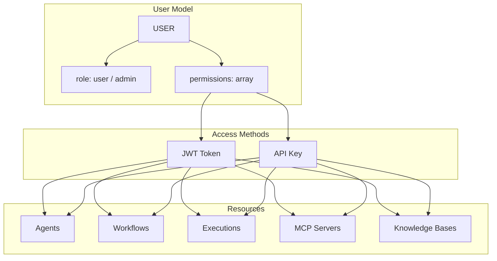

### User Owns Everything (Simple View)

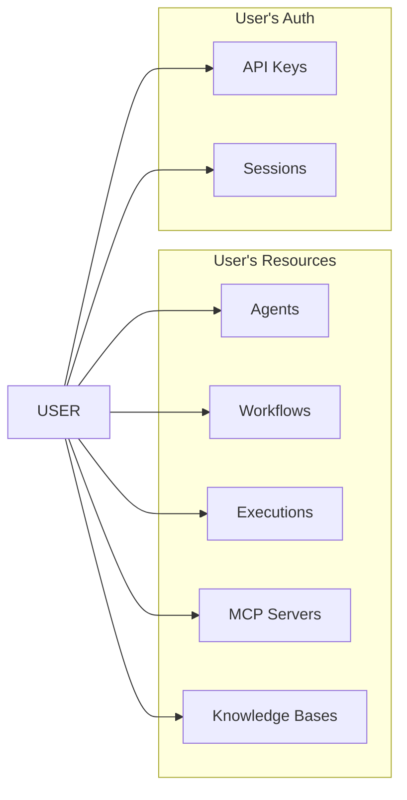

---

### Individual Table Diagrams

#### USERS Table

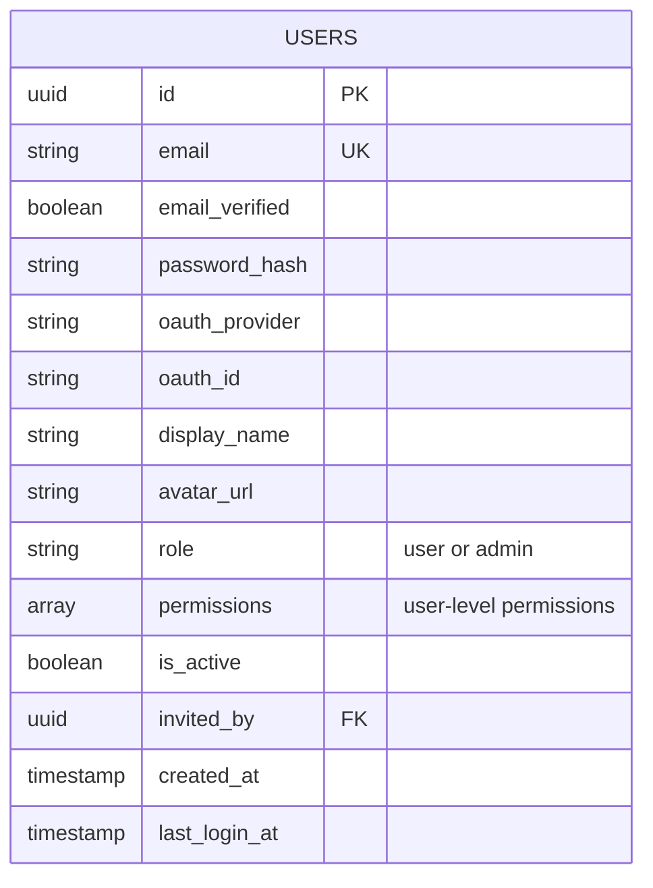

#### API_KEYS Table

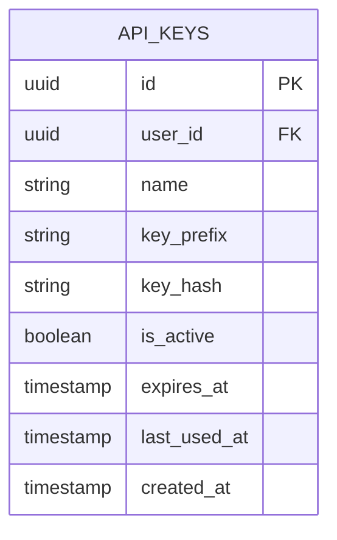

> **Note:** API keys don't have scopes. They inherit permissions from the user.

#### REFRESH_TOKENS Table

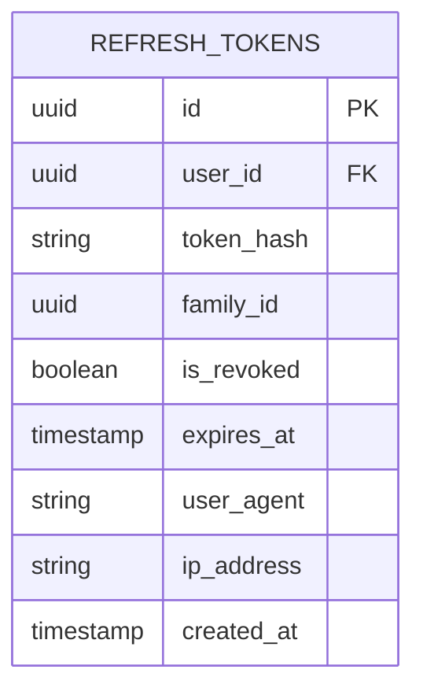

#### INVITES Table

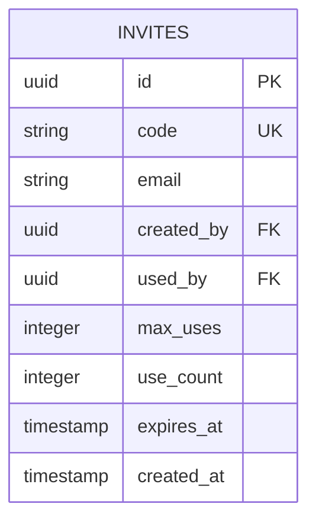

#### USER_SECRETS Table (for LLM API Keys)

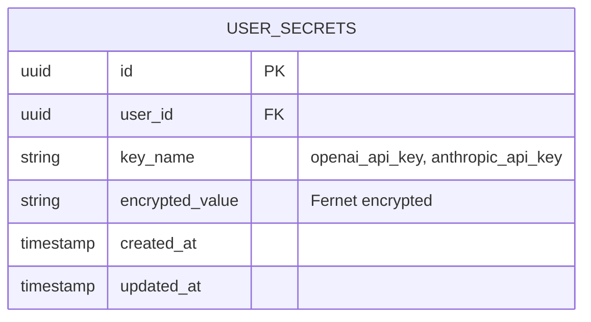

> **Security:** Values are encrypted with Fernet (AES-128-CBC). Encryption key stored in environment variable, never in database.

#### ORGANIZATIONS Table

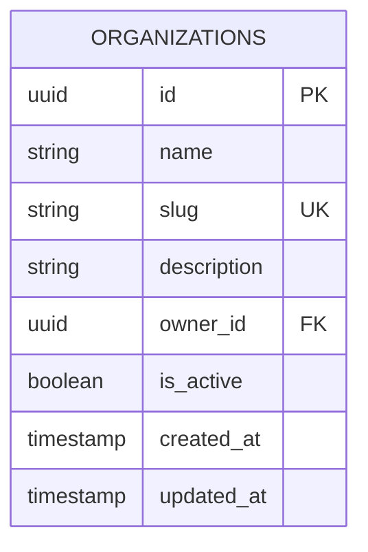

#### ORG_MEMBERS Table

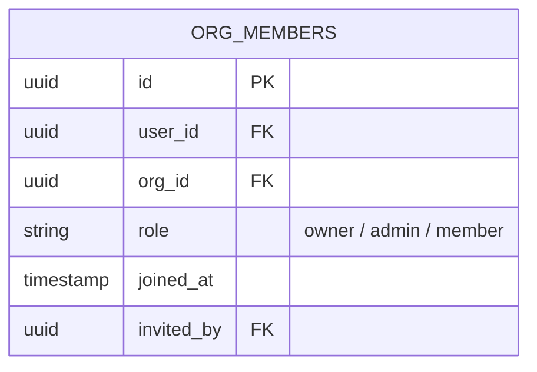

> **Org Roles:**
> - `owner`: Full control, can delete org
> - `admin`: Manage members, manage resources
> - `member`: Access shared resources

#### USAGE_RECORDS Table

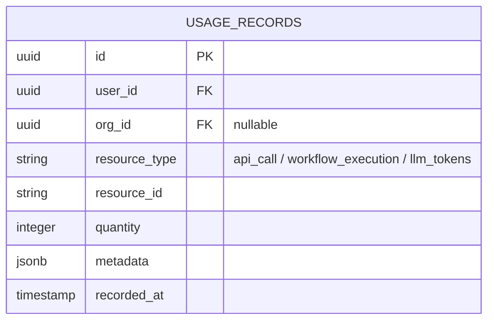

#### USAGE_LIMITS Table

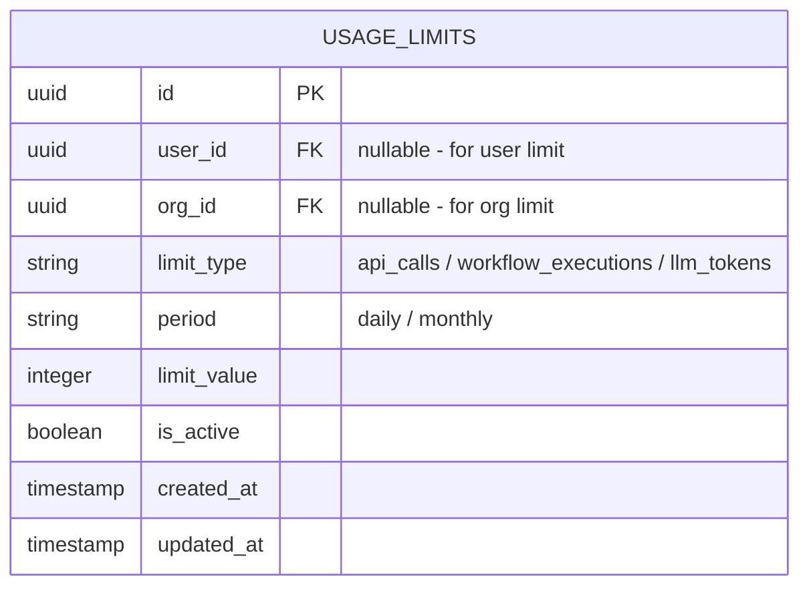

> **Limit Logic:** Check usage_records against usage_limits before allowing operations. Either user_id OR org_id is set, not both.

#### WORKFLOW_EXECUTIONS Table (Modified)

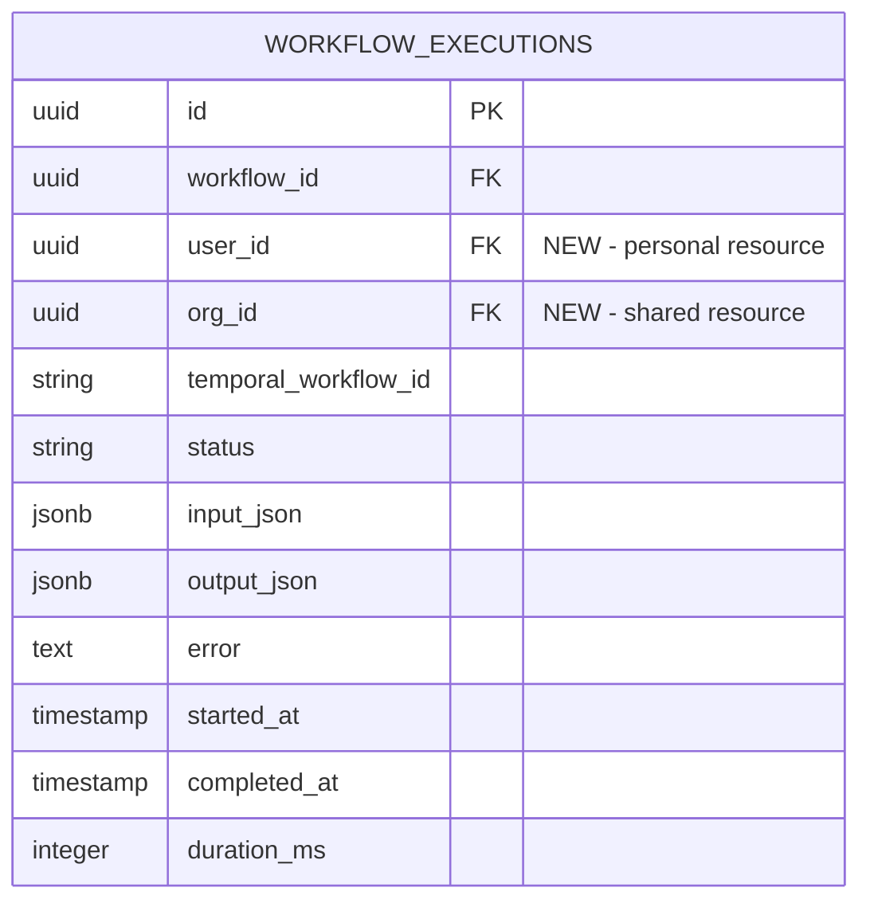

### Detailed Tables (For Developers)

#### New Tables

```
┌─────────────────────────────────────────────────────────────┐
│                          USERS                               │
├─────────────────────────────────────────────────────────────┤
│ id            │ UUID        │ Primary Key                   │
│ email         │ VARCHAR     │ Unique, Required              │
│ password_hash │ VARCHAR     │ Nullable (OAuth users)        │
│ oauth_provider│ VARCHAR     │ 'google' | 'github' | null    │
│ oauth_id      │ VARCHAR     │ Provider's user ID            │
│ display_name  │ VARCHAR     │ User's name                   │
│ avatar_url    │ VARCHAR     │ Profile picture               │
│ role          │ VARCHAR     │ 'user' or 'admin'             │
│ permissions   │ ARRAY       │ ['agents:read', 'workflows:*']│
│ is_active     │ BOOLEAN     │ Account active                │
│ invited_by    │ UUID FK     │ References users.id           │
│ created_at    │ TIMESTAMP   │ Auto                          │
│ last_login_at │ TIMESTAMP   │ Updated on login              │
└─────────────────────────────────────────────────────────────┘

┌─────────────────────────────────────────────────────────────┐
│                         API_KEYS                             │
├─────────────────────────────────────────────────────────────┤
│ id            │ UUID        │ Primary Key                   │
│ user_id       │ UUID FK     │ References users.id           │
│ name          │ VARCHAR     │ "Production API Key"          │
│ key_prefix    │ VARCHAR     │ "mag_sk_abc1" (for display)   │
│ key_hash      │ VARCHAR     │ SHA-256 hash (for lookup)     │
│ expires_at    │ TIMESTAMP   │ Optional expiration           │
│ last_used_at  │ TIMESTAMP   │ Track usage                   │
│ is_active     │ BOOLEAN     │ Can be revoked                │
└─────────────────────────────────────────────────────────────┘
Note: No scopes on API keys - they inherit user's permissions

┌─────────────────────────────────────────────────────────────┐
│                      REFRESH_TOKENS                          │
├─────────────────────────────────────────────────────────────┤
│ id            │ UUID        │ Primary Key                   │
│ user_id       │ UUID FK     │ References users.id           │
│ token_hash    │ VARCHAR     │ SHA-256 hash                  │
│ family_id     │ UUID        │ For rotation tracking         │
│ is_revoked    │ BOOLEAN     │ Invalidated token             │
│ expires_at    │ TIMESTAMP   │ 7 days from creation          │
│ user_agent    │ VARCHAR     │ Browser/client info           │
│ ip_address    │ VARCHAR     │ Client IP                     │
└─────────────────────────────────────────────────────────────┘

┌─────────────────────────────────────────────────────────────┐
│                          INVITES                             │
├─────────────────────────────────────────────────────────────┤
│ id            │ UUID        │ Primary Key                   │
│ code          │ VARCHAR     │ Unique invite code            │
│ email         │ VARCHAR     │ Optional: restrict to email   │
│ created_by    │ UUID FK     │ Who created the invite        │
│ used_by       │ UUID FK     │ Who used it                   │
│ max_uses      │ INTEGER     │ How many times can be used    │
│ use_count     │ INTEGER     │ Current usage count           │
│ expires_at    │ TIMESTAMP   │ When invite expires           │
└─────────────────────────────────────────────────────────────┘

┌─────────────────────────────────────────────────────────────┐
│                       USER_SECRETS                           │
├─────────────────────────────────────────────────────────────┤
│ id            │ UUID        │ Primary Key                   │
│ user_id       │ UUID FK     │ References users.id           │
│ key_name      │ VARCHAR     │ 'openai_api_key', etc.        │
│ encrypted_value│ TEXT       │ Fernet encrypted (AES-128)    │
│ created_at    │ TIMESTAMP   │ Auto                          │
│ updated_at    │ TIMESTAMP   │ Auto                          │
└─────────────────────────────────────────────────────────────┘
Note: Encryption key stored in ENV, never in database

┌─────────────────────────────────────────────────────────────┐
│                       ORGANIZATIONS                          │
├─────────────────────────────────────────────────────────────┤
│ id            │ UUID        │ Primary Key                   │
│ name          │ VARCHAR     │ Display name                  │
│ slug          │ VARCHAR     │ Unique URL-safe identifier    │
│ description   │ TEXT        │ Optional description          │
│ owner_id      │ UUID FK     │ References users.id           │
│ is_active     │ BOOLEAN     │ Org is active                 │
│ created_at    │ TIMESTAMP   │ Auto                          │
│ updated_at    │ TIMESTAMP   │ Auto                          │
└─────────────────────────────────────────────────────────────┘

┌─────────────────────────────────────────────────────────────┐
│                        ORG_MEMBERS                           │
├─────────────────────────────────────────────────────────────┤
│ id            │ UUID        │ Primary Key                   │
│ user_id       │ UUID FK     │ References users.id           │
│ org_id        │ UUID FK     │ References organizations.id   │
│ role          │ VARCHAR     │ 'owner' | 'admin' | 'member'  │
│ joined_at     │ TIMESTAMP   │ When user joined              │
│ invited_by    │ UUID FK     │ References users.id           │
└─────────────────────────────────────────────────────────────┘
Note: Unique constraint on (user_id, org_id)

┌─────────────────────────────────────────────────────────────┐
│                       USAGE_RECORDS                          │
├─────────────────────────────────────────────────────────────┤
│ id            │ UUID        │ Primary Key                   │
│ user_id       │ UUID FK     │ References users.id           │
│ org_id        │ UUID FK     │ Nullable, for org usage       │
│ resource_type │ VARCHAR     │ 'api_call' | 'workflow' |     │
│               │             │ 'llm_tokens'                  │
│ resource_id   │ VARCHAR     │ Optional: specific resource   │
│ quantity      │ INTEGER     │ Amount used                   │
│ metadata      │ JSONB       │ Additional details            │
│ recorded_at   │ TIMESTAMP   │ When usage occurred           │
└─────────────────────────────────────────────────────────────┘

┌─────────────────────────────────────────────────────────────┐
│                        USAGE_LIMITS                          │
├─────────────────────────────────────────────────────────────┤
│ id            │ UUID        │ Primary Key                   │
│ user_id       │ UUID FK     │ Nullable (for user limit)     │
│ org_id        │ UUID FK     │ Nullable (for org limit)      │
│ limit_type    │ VARCHAR     │ 'api_calls' | 'workflows' |   │
│               │             │ 'llm_tokens'                  │
│ period        │ VARCHAR     │ 'daily' | 'monthly'           │
│ limit_value   │ INTEGER     │ Max allowed in period         │
│ is_active     │ BOOLEAN     │ Limit is enforced             │
│ created_at    │ TIMESTAMP   │ Auto                          │
│ updated_at    │ TIMESTAMP   │ Auto                          │
└─────────────────────────────────────────────────────────────┘
Note: Either user_id OR org_id is set, not both
```

#### Modified Tables (Add user_id + org_id)

```
┌───────────────────────────────────────────────────────────────┐
│  Existing Table      │  Changes                               │
├───────────────────────────────────────────────────────────────┤
│  agents              │  + user_id (FK), + org_id (FK)         │
│  workflows           │  + user_id (FK), + org_id (FK)         │
│  workflow_executions │  + user_id (FK), + org_id (FK)         │
│  mcp_servers         │  + user_id (FK), + org_id (FK)         │
│  knowledge_bases     │  + user_id (FK), + org_id (FK)         │
└───────────────────────────────────────────────────────────────┘

Ownership Rules:
  - Personal Resource: user_id is set, org_id is NULL
  - Shared Resource: org_id is set, user_id is NULL (or set to creator)
  - One MUST be set (constraint: user_id IS NOT NULL OR org_id IS NOT NULL)

Foreign Keys:
  - user_id: References users.id, ON DELETE CASCADE
  - org_id: References organizations.id, ON DELETE CASCADE
  - Both indexed for fast queries
```

### Summary Table

| Table | Status | Key Fields | Purpose |
|:------|:------:|:-----------|:--------|
| `users` | NEW | email, role, permissions | User accounts |
| `organizations` | NEW | slug, owner_id | Teams/companies |
| `org_members` | NEW | user_id, org_id, role | User-to-org membership |
| `api_keys` | NEW | key_hash | Platform API keys |
| `user_secrets` | NEW | key_name, encrypted_value | User's LLM keys (OpenAI, etc.) |
| `refresh_tokens` | NEW | token_hash, family_id | Session management |
| `invites` | NEW | code, max_uses | User invitations |
| `usage_records` | NEW | resource_type, quantity | Track API calls, tokens |
| `usage_limits` | NEW | limit_type, limit_value | Configurable caps |
| `agents` | MOD | + user_id, + org_id | AI agents |
| `workflows` | MOD | + user_id, + org_id | Workflow definitions |
| `workflow_executions` | MOD | + user_id, + org_id | Execution history |
| `mcp_servers` | MOD | + user_id, + org_id | MCP integrations |
| `knowledge_bases` | MOD | + user_id, + org_id | Knowledge storage |

---

## User & Organization Model

### User Model

```
┌─────────────────────────────────────────────────────────────┐
│                        USER MODEL                            │
├─────────────────────────────────────────────────────────────┤
│                                                             │
│  Identity:                                                  │
│    - email (unique identifier)                              │
│    - password_hash OR oauth_provider + oauth_id             │
│    - display_name, avatar_url                               │
│                                                             │
│  Platform Role:                                             │
│    - role: 'user' | 'admin'                                 │
│    - admin can access all resources, manage users           │
│                                                             │
│  Permissions:                                               │
│    - Array of permissions like ['agents:read', '*']         │
│    - Used for both JWT and API key access                   │
│                                                             │
└─────────────────────────────────────────────────────────────┘
```

### Organization Model

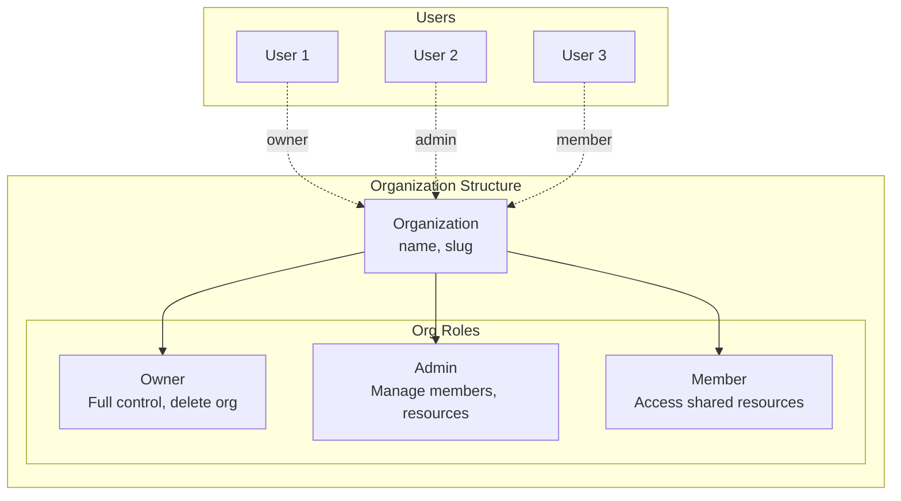

### Multi-Org Membership

A user can belong to multiple organizations with different roles:

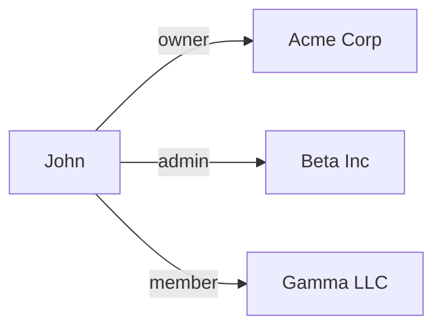

---

## Permissions & Roles

### Platform Permissions

Permissions are stored on the USER, not on API keys:

```
┌─────────────────────────────────────────────────────────────┐
│                    PERMISSION SYSTEM                         │
├─────────────────────────────────────────────────────────────┤
│                                                             │
│  Format: resource:action                                    │
│                                                             │
│  Resources:      Actions:                                   │
│    - agents        - read                                   │
│    - workflows     - write                                  │
│    - mcp           - delete                                 │
│    - knowledge     - execute (workflows only)               │
│                                                             │
│  Special:                                                   │
│    - '*' = full access to everything                        │
│    - 'agents:*' = all actions on agents                     │
│                                                             │
│  Examples:                                                  │
│    - ['*'] = admin-like access                              │
│    - ['agents:read', 'workflows:read'] = read-only          │
│    - ['workflows:execute'] = can only run workflows         │
│                                                             │
└─────────────────────────────────────────────────────────────┘
```

### Role Hierarchy

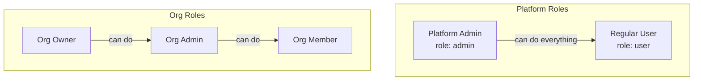

### Permission Check Flow

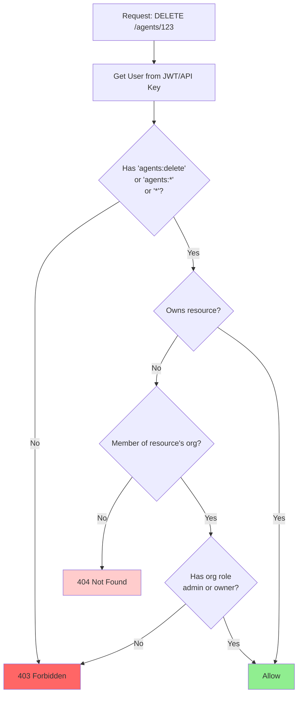

---

## API Keys & Secrets

### Platform API Keys

For accessing MagOneAI from scripts/automation:

```
┌─────────────────────────────────────────────────────────────┐
│                    PLATFORM API KEY                          │
├─────────────────────────────────────────────────────────────┤
│                                                             │
│  Format: mag_sk_{256_bits_base64url}                        │
│  Example: mag_sk_dGhpcyBpcyBhIHRlc3QgYXBpIGtleQ...         │
│                                                             │
│  Storage:                                                   │
│    - Key shown once on creation (cannot retrieve later)     │
│    - Only SHA-256 hash stored in database                   │
│    - Prefix stored for display (mag_sk_dGhp...)            │
│                                                             │
│  Permissions:                                               │
│    - API key inherits user's permissions                    │
│    - No separate scopes on API keys                         │
│    - Revoking user permissions affects all their API keys   │
│                                                             │
│  Lifecycle:                                                 │
│    - Optional expiration date                               │
│    - Can be revoked at any time                             │
│    - last_used_at tracked for audit                         │
│                                                             │
└─────────────────────────────────────────────────────────────┘
```

### User Secrets (LLM Keys)

For storing user's own LLM provider API keys:

```
┌─────────────────────────────────────────────────────────────┐
│                      USER SECRETS                            │
├─────────────────────────────────────────────────────────────┤
│                                                             │
│  Purpose: Store user's OpenAI, Anthropic, etc. keys         │
│                                                             │
│  Security:                                                  │
│    - Encrypted with Fernet (AES-128-CBC + HMAC)            │
│    - Master encryption key in ENV variable                  │
│    - Never stored in plaintext in database                  │
│    - Decrypted only when agent needs to call LLM           │
│                                                             │
│  Supported Keys:                                            │
│    - openai_api_key                                         │
│    - anthropic_api_key                                      │
│    - (extensible for other providers)                       │
│                                                             │
│  Billing:                                                   │
│    - User pays their own LLM bills directly                 │
│    - We never see or handle their LLM usage charges         │
│                                                             │
└─────────────────────────────────────────────────────────────┘
```

### Secret Storage Flow

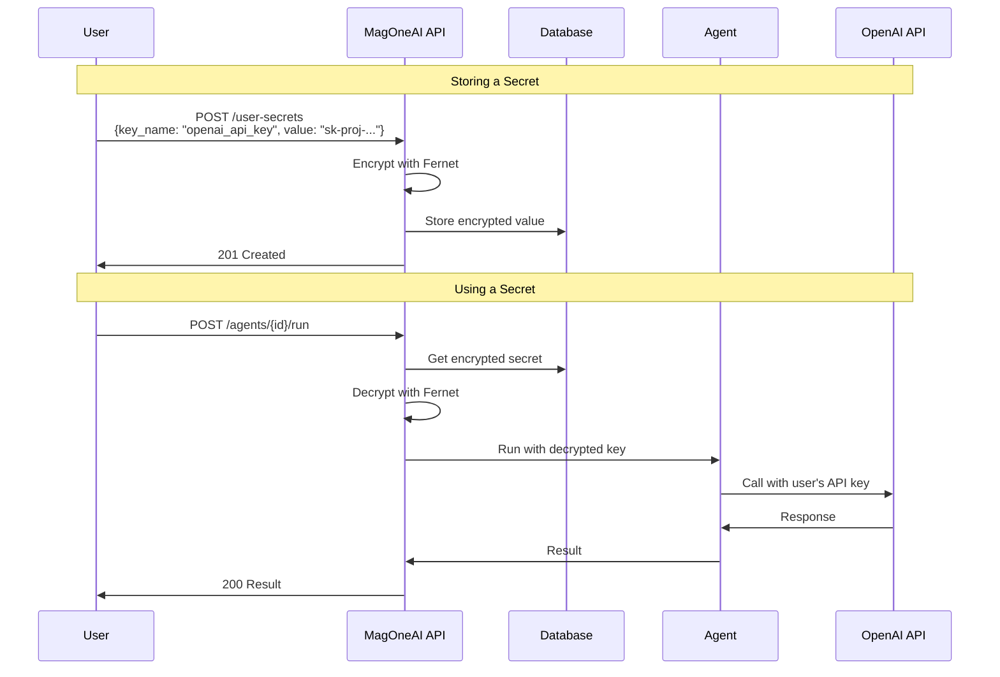

---

## Usage Tracking & Limits

### What We Track

```
┌─────────────────────────────────────────────────────────────┐
│                     USAGE TRACKING                           │
├─────────────────────────────────────────────────────────────┤
│                                                             │
│  Resource Types:                                            │
│                                                             │
│  1. api_calls                                               │
│     - Every API request to our platform                     │
│     - Counted per user or org                               │
│                                                             │
│  2. workflow_executions                                     │
│     - Each workflow run                                     │
│     - Includes resource_id (workflow_id)                    │
│                                                             │
│  3. llm_tokens                                              │
│     - Token usage from LLM calls                            │
│     - Tracked even though user pays their own bill          │
│     - Useful for quotas/fair use limits                     │
│                                                             │
│  Metadata (JSONB):                                          │
│     - endpoint, method, status_code (for API calls)         │
│     - model, input_tokens, output_tokens (for LLM)          │
│     - duration_ms, status (for workflows)                   │
│                                                             │
└─────────────────────────────────────────────────────────────┘
```

### Usage Limits

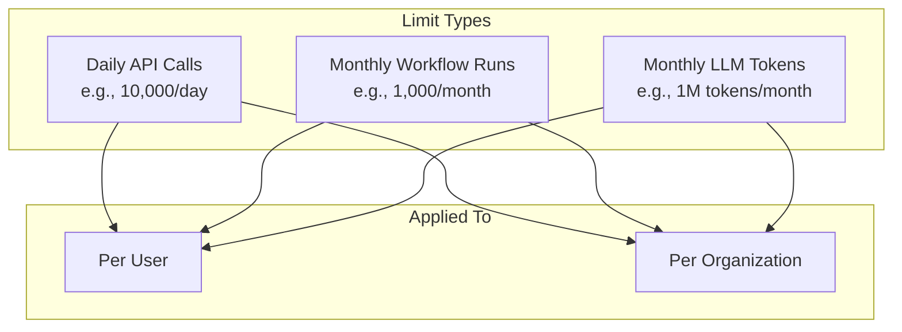

### Limit Check Flow

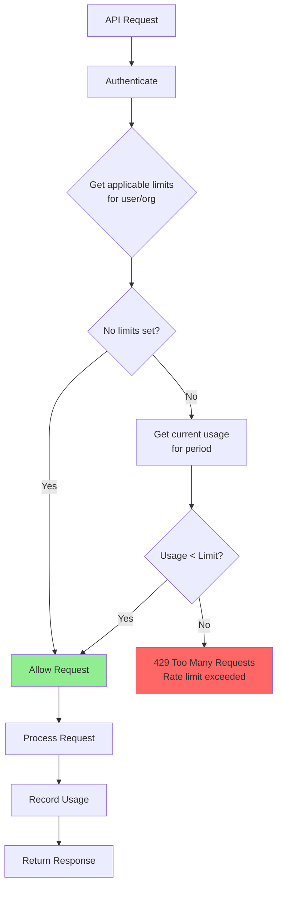

### Usage Query Examples

```sql
-- Get user's API calls this month
SELECT COUNT(*) as api_calls
FROM usage_records
WHERE user_id = 'user_123'
  AND resource_type = 'api_calls'
  AND recorded_at >= date_trunc('month', now());

-- Get org's token usage this month
SELECT SUM(quantity) as total_tokens
FROM usage_records
WHERE org_id = 'org_456'
  AND resource_type = 'llm_tokens'
  AND recorded_at >= date_trunc('month', now());

-- Check if user is over limit
SELECT
  ul.limit_value,
  COALESCE(SUM(ur.quantity), 0) as current_usage,
  ul.limit_value - COALESCE(SUM(ur.quantity), 0) as remaining
FROM usage_limits ul
LEFT JOIN usage_records ur ON
  ur.user_id = ul.user_id
  AND ur.resource_type = ul.limit_type
  AND ur.recorded_at >= CASE
    WHEN ul.period = 'daily' THEN date_trunc('day', now())
    WHEN ul.period = 'monthly' THEN date_trunc('month', now())
  END
WHERE ul.user_id = 'user_123'
  AND ul.is_active = true
GROUP BY ul.id, ul.limit_type, ul.limit_value;
```

---

## Authentication Flows

### Registration Flow (Flowchart)

```mermaid
flowchart TD
    START([🧑 User Opens Register Page]) --> FORM[📝 Fill Registration Form<br/>email, password, name]
    FORM --> INVITE{🎫 Invite Code<br/>Required?}

    INVITE -->|Yes| CHECK_INV{Validate<br/>Invite Code}
    INVITE -->|No| CHECK_EMAIL

    CHECK_INV -->|Invalid| ERR_INV[❌ Error: Invalid Invite]
    CHECK_INV -->|Expired| ERR_EXP[❌ Error: Invite Expired]
    CHECK_INV -->|Valid| CHECK_EMAIL

    CHECK_EMAIL{📧 Email<br/>Already Exists?}
    CHECK_EMAIL -->|Yes| ERR_DUP[❌ Error: Email Taken]
    CHECK_EMAIL -->|No| HASH

    HASH[🔐 Hash Password<br/>Argon2id] --> CREATE[💾 Create User Record]
    CREATE --> TOKENS[🎫 Generate Tokens<br/>Access + Refresh]
    TOKENS --> STORE[💾 Store Refresh Token]
    STORE --> EMAIL[📨 Send Verification Email]
    EMAIL --> RESPONSE[✅ Return Tokens + User]
    RESPONSE --> DASHBOARD([🏠 Redirect to Dashboard])

    ERR_INV --> FORM
    ERR_EXP --> FORM
    ERR_DUP --> FORM

    style START fill:#90EE90
    style DASHBOARD fill:#90EE90
    style ERR_INV fill:#ff6666
    style ERR_EXP fill:#ff6666
    style ERR_DUP fill:#ff6666
```

### Login Flow (Flowchart)

```mermaid
flowchart TD
    START([🧑 User Opens Login Page]) --> FORM[📝 Enter Email & Password]
    FORM --> SUBMIT[📤 POST /auth/login]

    SUBMIT --> FIND{🔍 Find User<br/>by Email}
    FIND -->|Not Found| ERR_CRED[❌ Invalid Credentials]

    FIND -->|Found| CHECK_LOCK{🔒 Account<br/>Locked?}
    CHECK_LOCK -->|Yes| ERR_LOCK[❌ Account Locked<br/>Try again later]

    CHECK_LOCK -->|No| VERIFY{🔐 Verify<br/>Password}
    VERIFY -->|Invalid| INC_FAIL[📊 Increment Failed Attempts]
    INC_FAIL --> ERR_CRED

    VERIFY -->|Valid| GEN_ACCESS[🎫 Generate Access Token<br/>15 min expiry]
    GEN_ACCESS --> GEN_REFRESH[🔄 Generate Refresh Token<br/>7 day expiry]
    GEN_REFRESH --> STORE[💾 Store Refresh Token Hash]
    STORE --> UPDATE[📅 Update last_login_at]
    UPDATE --> RESPONSE[✅ Return Access Token<br/>+ Set Cookie]
    RESPONSE --> SAVE[💾 Save to localStorage]
    SAVE --> DASHBOARD([🏠 Redirect to Dashboard])

    ERR_CRED --> FORM
    ERR_LOCK --> WAIT([⏳ Wait & Retry])

    style START fill:#90EE90
    style DASHBOARD fill:#90EE90
    style ERR_CRED fill:#ff6666
    style ERR_LOCK fill:#ff6666
```

### Logout Flow (Flowchart)

```mermaid
flowchart TD
    START([🧑 User Clicks Logout]) --> SEND[📤 POST /auth/logout]
    SEND --> EXTRACT[🔍 Extract Refresh Token<br/>from Cookie]
    EXTRACT --> REVOKE[🚫 Revoke Token]
    REVOKE --> REVOKE_FAM[🚫 Revoke All Tokens<br/>in Family]
    REVOKE_FAM --> CLEAR[🗑️ Clear Cookie]
    CLEAR --> RESPONSE[✅ 200 OK]
    RESPONSE --> REMOVE[🗑️ Remove from localStorage]
    REMOVE --> LOGIN([🔐 Redirect to Login])

    style START fill:#90EE90
    style LOGIN fill:#87CEEB
```

### Complete Auth Flow Overview

```mermaid
flowchart LR
    subgraph "🔓 Public"
        REG[Register]
        LOG[Login]
        OAUTH[OAuth]
        FORGOT[Forgot Password]
    end

    subgraph "🔐 Protected"
        DASH[Dashboard]
        AGENTS[Agents]
        WORKFLOWS[Workflows]
        SETTINGS[Settings]
    end

    subgraph "🎫 Token Management"
        ACCESS[Access Token<br/>15 min]
        REFRESH[Refresh Token<br/>7 days]
    end

    REG --> ACCESS
    LOG --> ACCESS
    OAUTH --> ACCESS

    ACCESS --> DASH
    ACCESS --> AGENTS
    ACCESS --> WORKFLOWS
    ACCESS --> SETTINGS

    ACCESS -.->|Expires| REFRESH
    REFRESH -.->|New| ACCESS

    style ACCESS fill:#FFD700
    style REFRESH fill:#87CEEB
```

---

## API Key System

### API Key Generation Flow (Flowchart)

```mermaid
flowchart TD
    START([🧑 User: Create API Key]) --> AUTH{🔐 JWT Valid?}
    AUTH -->|No| ERR_AUTH[❌ 401 Unauthorized]
    AUTH -->|Yes| INPUT[📝 Enter Key Name & Scopes]

    INPUT --> GENERATE[🎲 Generate Random Key<br/>mag_sk_ + 256 bits]
    GENERATE --> HASH[🔐 Hash Key<br/>SHA-256]
    HASH --> PREFIX[🏷️ Extract Prefix<br/>First 12 chars]

    PREFIX --> STORE[💾 Store in Database<br/>user_id, key_hash, name, scopes]
    STORE --> RESPONSE[✅ Return Full Key<br/>⚠️ SHOWN ONLY ONCE!]
    RESPONSE --> DISPLAY([📋 User Copies Key])

    ERR_AUTH --> START

    style START fill:#90EE90
    style DISPLAY fill:#90EE90
    style ERR_AUTH fill:#ff6666
    style RESPONSE fill:#FFD700
```

### API Key Authentication Flow (Flowchart)

```mermaid
flowchart TD
    START([🤖 API Request]) --> EXTRACT[📥 Extract X-API-Key Header]
    EXTRACT --> HASH[🔐 Hash Key<br/>SHA-256]

    HASH --> LOOKUP{🔍 Find Key<br/>by Hash}
    LOOKUP -->|Not Found| ERR_KEY[❌ 401 Invalid API Key]

    LOOKUP -->|Found| ACTIVE{✅ Key Active?}
    ACTIVE -->|No| ERR_REV[❌ 401 Key Revoked]

    ACTIVE -->|Yes| EXPIRED{⏰ Key Expired?}
    EXPIRED -->|Yes| ERR_EXP[❌ 401 Key Expired]

    EXPIRED -->|No| SCOPE{📋 Has Required<br/>Scope?}
    SCOPE -->|No| ERR_SCOPE[❌ 403 Scope Required]

    SCOPE -->|Yes| UPDATE[📅 Update last_used_at]
    UPDATE --> SETUSER[👤 Set current_user<br/>from key.user_id]
    SETUSER --> PROCESS[⚙️ Process Request]
    PROCESS --> SUCCESS([✅ 200 OK])

    style START fill:#87CEEB
    style SUCCESS fill:#90EE90
    style ERR_KEY fill:#ff6666
    style ERR_REV fill:#ff6666
    style ERR_EXP fill:#ff6666
    style ERR_SCOPE fill:#ff9999
```

### API Key Format

```mermaid
flowchart LR
    subgraph "API Key Structure"
        PREFIX["mag_sk_"]
        RANDOM["dGhpcyBpcyBhIHRlc3Q..."]
    end

    subgraph "Storage"
        STORED_PREFIX["Prefix: mag_sk_dGhp"]
        STORED_HASH["Hash: SHA256(full_key)"]
    end

    subgraph "Lookup"
        INPUT_KEY["X-API-Key: mag_sk_..."]
        COMPUTE["SHA256(input)"]
        MATCH["Match hash in DB"]
    end

    PREFIX --- RANDOM
    RANDOM --> STORED_PREFIX
    RANDOM --> STORED_HASH
    INPUT_KEY --> COMPUTE --> MATCH

    style PREFIX fill:#4CAF50,color:#fff
    style STORED_HASH fill:#FFD700
```

### User Permissions Model

Permissions are stored on the **User**, not on API keys:

```mermaid
graph TD
    subgraph "User Permissions (stored in users.permissions)"
        ALL["* (full access)"]

        subgraph "Resource Permissions"
            AR[agents:read]
            AW[agents:write]
            AD[agents:delete]

            WR[workflows:read]
            WW[workflows:write]
            WE[workflows:execute]

            KR[knowledge:read]
            KW[knowledge:write]

            MR[mcp:read]
            MW[mcp:write]
        end
    end

    ALL --> AR
    ALL --> AW
    ALL --> AD
    ALL --> WR
    ALL --> WW
    ALL --> WE
    ALL --> KR
    ALL --> KW
    ALL --> MR
    ALL --> MW
```

**How permissions flow:**
```
User (has permissions)
    │
    ├─── JWT Login ──→ Token contains user's permissions
    │
    └─── API Key ────→ Lookup user → Get user's permissions
```

---

## OAuth Integration

### Google OAuth Flow (Flowchart)

```mermaid
flowchart TD
    START([🧑 Click "Sign in with Google"]) --> REQ[📤 GET /auth/google]
    REQ --> STATE[🔐 Generate State Token<br/>CSRF Protection]
    STATE --> REDIRECT[↗️ Redirect to Google]

    subgraph "Google"
        REDIRECT --> CONSENT[📋 User Approves Permissions]
        CONSENT --> CALLBACK[↩️ Redirect to Callback]
    end

    CALLBACK --> VERIFY{🔍 Verify State<br/>Token}
    VERIFY -->|Invalid| ERR_STATE[❌ Invalid State]

    VERIFY -->|Valid| EXCHANGE[🔄 Exchange Code<br/>for Tokens]
    EXCHANGE --> USERINFO[📥 Get User Info<br/>id, email, name, picture]

    USERINFO --> FIND{🔍 Find User by<br/>Google ID}
    FIND -->|New User| CREATE[👤 Create Account]
    FIND -->|Existing| UPDATE[📝 Update Last Login]

    CREATE --> TOKENS[🎫 Generate JWT Tokens]
    UPDATE --> TOKENS

    TOKENS --> STORE[💾 Store Refresh Token]
    STORE --> REDIRECT_APP[↗️ Redirect to App]
    REDIRECT_APP --> DASHBOARD([🏠 Dashboard])

    ERR_STATE --> START

    style START fill:#90EE90
    style DASHBOARD fill:#90EE90
    style ERR_STATE fill:#ff6666
```

### GitHub OAuth Flow (Flowchart)

```mermaid
flowchart TD
    START([🧑 Click "Sign in with GitHub"]) --> REQ[📤 GET /auth/github]
    REQ --> STATE[🔐 Generate State Token]
    STATE --> REDIRECT[↗️ Redirect to GitHub]

    subgraph "GitHub"
        REDIRECT --> CONSENT[📋 User Approves Permissions]
        CONSENT --> CALLBACK[↩️ Redirect to Callback]
    end

    CALLBACK --> VERIFY{🔍 Verify State}
    VERIFY -->|Invalid| ERR_STATE[❌ Invalid State]

    VERIFY -->|Valid| EXCHANGE[🔄 Exchange Code<br/>for Access Token]
    EXCHANGE --> USER[📥 GET /user<br/>id, login, name]
    USER --> EMAILS[📧 GET /user/emails]
    EMAILS --> SELECT[✅ Select Primary<br/>Verified Email]

    SELECT --> FIND{🔍 Find User by<br/>GitHub ID}
    FIND -->|New User| CREATE[👤 Create Account]
    FIND -->|Existing| UPDATE[📝 Update Last Login]

    CREATE --> TOKENS[🎫 Generate JWT Tokens]
    UPDATE --> TOKENS

    TOKENS --> REDIRECT_APP[↗️ Redirect to App]
    REDIRECT_APP --> DASHBOARD([🏠 Dashboard])

    ERR_STATE --> START

    style START fill:#90EE90
    style DASHBOARD fill:#90EE90
    style ERR_STATE fill:#ff6666
```

### OAuth Flow Comparison

```mermaid
flowchart LR
    subgraph "Step 1: Initiate"
        G1[GET /auth/google]
        GH1[GET /auth/github]
    end

    subgraph "Step 2: Redirect"
        G2[accounts.google.com]
        GH2[github.com/login]
    end

    subgraph "Step 3: Callback"
        G3[/callback/google]
        GH3[/callback/github]
    end

    subgraph "Step 4: Exchange"
        G4[Get Tokens + User Info]
        GH4[Get Token + User + Emails]
    end

    subgraph "Step 5: Complete"
        DONE[Generate JWT<br/>Create/Update User<br/>Redirect to App]
    end

    G1 --> G2 --> G3 --> G4 --> DONE
    GH1 --> GH2 --> GH3 --> GH4 --> DONE

    style G1 fill:#4285F4,color:#fff
    style G2 fill:#4285F4,color:#fff
    style G3 fill:#4285F4,color:#fff
    style G4 fill:#4285F4,color:#fff
    style GH1 fill:#333,color:#fff
    style GH2 fill:#333,color:#fff
    style GH3 fill:#333,color:#fff
    style GH4 fill:#333,color:#fff
    style DONE fill:#90EE90
```

### OAuth Account Linking

```mermaid
flowchart TD
    subgraph "OAuth Callback Handler"
        A[Receive OAuth callback] --> B{State valid?}
        B -->|No| C[401 Invalid state]
        B -->|Yes| D[Exchange code for tokens]
        D --> E[Get user info from provider]
        E --> F{Find existing user?}

        F -->|By OAuth ID| G[Update & login existing]
        F -->|By Email| H{Email has password?}
        F -->|Not found| I{Registration enabled?}

        H -->|Yes| J[Link OAuth to existing account]
        H -->|No| K[Error: Account exists with different provider]

        I -->|Yes| L{Invite required?}
        I -->|No| M[403 Registration disabled]

        L -->|Yes| N{Valid invite in state?}
        L -->|No| O[Create new account]

        N -->|Yes| O
        N -->|No| P[403 Invite required]

        G --> Q[Generate tokens]
        J --> Q
        O --> Q
        Q --> R[Redirect to frontend]
    end
```

---

## Token Refresh Mechanism

### Token Refresh with Rotation (Flowchart)

```mermaid
flowchart TD
    START([⏰ Access Token Expired]) --> SEND[📤 POST /auth/refresh<br/>Cookie: refresh_token]

    SEND --> EXTRACT[📥 Extract Token from Cookie]
    EXTRACT --> HASH[🔐 Hash Token]

    HASH --> FIND{🔍 Find Token<br/>by Hash}
    FIND -->|Not Found| ERR_INV[❌ 401 Invalid Token]

    FIND -->|Found| REVOKED{🚫 Token<br/>Revoked?}
    REVOKED -->|Yes| THEFT[⚠️ THEFT DETECTED!]
    THEFT --> REVOKE_ALL[🚫 Revoke ALL<br/>in Token Family]
    REVOKE_ALL --> ERR_REUSE[❌ 401 Token Reuse]

    REVOKED -->|No| EXPIRED{⏰ Token<br/>Expired?}
    EXPIRED -->|Yes| ERR_EXP[❌ 401 Token Expired]

    EXPIRED -->|No| REVOKE_OLD[🚫 Revoke Current Token]
    REVOKE_OLD --> GEN_ACCESS[🎫 Generate New Access Token]
    GEN_ACCESS --> GEN_REFRESH[🔄 Generate New Refresh Token<br/>Same Family ID]
    GEN_REFRESH --> STORE[💾 Store New Refresh Token]
    STORE --> RESPONSE[✅ Return New Tokens]
    RESPONSE --> UPDATE([💾 Update localStorage])

    ERR_INV --> LOGIN([🔐 Redirect to Login])
    ERR_REUSE --> LOGIN
    ERR_EXP --> LOGIN

    style START fill:#FFD700
    style UPDATE fill:#90EE90
    style LOGIN fill:#87CEEB
    style ERR_INV fill:#ff6666
    style ERR_REUSE fill:#ff6666
    style ERR_EXP fill:#ff6666
    style THEFT fill:#ff0000,color:#fff
```

### Token Lifecycle Overview

```mermaid
flowchart LR
    subgraph "Login"
        L1[User Logs In]
        L2[Generate Access<br/>15 min]
        L3[Generate Refresh<br/>7 days]
        L4[Create Family ID]
    end

    subgraph "Usage"
        U1[Access Token<br/>Used for API]
        U2[Expires after 15 min]
    end

    subgraph "Refresh"
        R1[Use Refresh Token]
        R2[Get New Access]
        R3[Get New Refresh<br/>Old Revoked]
    end

    subgraph "Logout/Expiry"
        E1[Logout or<br/>Refresh Expires]
        E2[All Family Tokens<br/>Revoked]
        E3[Must Login Again]
    end

    L1 --> L2 --> U1
    L1 --> L3 --> L4
    L3 --> R1
    U1 --> U2 --> R1
    R1 --> R2 --> U1
    R1 --> R3
    R3 -.-> R1
    L3 --> E1 --> E2 --> E3

    style L2 fill:#FFD700
    style L3 fill:#87CEEB
    style R3 fill:#87CEEB
```

### Token Family Tracking (Security)

```mermaid
flowchart TD
    subgraph "Token Family Concept"
        Login[User Login] --> Family1[Create Token Family: ABC]
        Family1 --> T1[Refresh Token 1]

        subgraph "Normal Flow"
            T1 -->|Refresh| T2[Refresh Token 2]
            T2 -->|Refresh| T3[Refresh Token 3]
            T3 -->|Refresh| T4[Refresh Token 4]
        end

        subgraph "Attack Detection"
            T2 -.->|Stolen & Reused| ATTACK[Token Reuse Detected!]
            ATTACK -->|Revoke| REVOKE[Revoke ALL in Family ABC]
            REVOKE --> FORCE[Force Re-login]
        end
    end

    style ATTACK fill:#ff6666
    style REVOKE fill:#ff9999
    style FORCE fill:#ffcccc
```

### Automatic Token Refresh (Frontend)

```mermaid
sequenceDiagram
    participant C as Component
    participant A as Axios Client
    participant API as Backend API
    participant Q as Request Queue

    C->>A: GET /agents (with expired token)
    A->>API: GET /agents
    Note over A,API: Authorization: Bearer {expired_token}

    API-->>A: 401 Token expired

    A->>A: Check if already refreshing

    alt Not refreshing
        A->>A: Set isRefreshing = true
        A->>API: POST /auth/refresh
        API-->>A: {access_token: "new_token"}
        A->>A: Store new token
        A->>A: Set isRefreshing = false
        A->>Q: Process queued requests
        A->>API: GET /agents (retry)
        API-->>A: 200 {agents: [...]}
        A-->>C: {agents: [...]}
    else Already refreshing
        A->>Q: Queue this request
        Note over Q: Wait for refresh to complete
        Q-->>A: Refresh done, retry
        A->>API: GET /agents (retry)
        API-->>A: 200 {agents: [...]}
        A-->>C: {agents: [...]}
    end
```

---

## Resource Ownership Model

### Personal vs Shared Resources

Resources can be owned by a user (personal) or an organization (shared):

```mermaid
flowchart TB
    subgraph "Personal Resources"
        USER1[User: john@example.com]
        USER1 --> PA1[Agent - My Bot]
        USER1 --> PW1[Workflow - My Tasks]
        USER1 --> PM1[MCP Server - Local]
    end

    subgraph "Shared Resources (Org: Acme Corp)"
        ORG[Organization: acme-corp]
        ORG --> SA1[Agent - Team Bot]
        ORG --> SW1[Workflow - Shared Pipeline]
        ORG --> SM1[MCP Server - Company]
    end

    subgraph "Org Members"
        USER1 -.->|member| ORG
        USER2[User: jane@example.com] -.->|admin| ORG
        USER3[User: bob@example.com] -.->|owner| ORG
    end
```

### Ownership Rules

```
┌─────────────────────────────────────────────────────────────┐
│                     OWNERSHIP RULES                          │
├─────────────────────────────────────────────────────────────┤
│                                                             │
│  Personal Resource:                                         │
│    - user_id = owner's ID                                   │
│    - org_id = NULL                                          │
│    - Only owner can access                                  │
│                                                             │
│  Shared Resource:                                           │
│    - user_id = NULL (or creator's ID for audit)            │
│    - org_id = organization's ID                             │
│    - All org members can access (based on org role)        │
│                                                             │
│  Database Constraint:                                       │
│    CHECK (user_id IS NOT NULL OR org_id IS NOT NULL)        │
│                                                             │
└─────────────────────────────────────────────────────────────┘
```

### Access Check Flow

```mermaid
flowchart LR
    subgraph "User: john@example.com"
        USER[User ID: user_123]
    end

    subgraph "Personal Query"
        PQ["SELECT * FROM agents<br/>WHERE user_id = 'user_123'"]
    end

    subgraph "Shared Query"
        SQ["SELECT * FROM agents<br/>WHERE org_id IN (<br/>  SELECT org_id FROM org_members<br/>  WHERE user_id = 'user_123'<br/>)"]
    end

    USER --> PQ
    USER --> SQ
```

**Combined rule:** User sees resources where `user_id` matches OR where `org_id` is in their organization memberships.

### Authorization Decision Flow

```mermaid
flowchart TD
    REQ[API Request] --> AUTH{Authenticated?}

    AUTH -->|No| E401[401 Unauthorized]
    AUTH -->|Yes| EXTRACT[Extract user from JWT/API Key]

    EXTRACT --> RESOURCE{Resource request?}

    RESOURCE -->|Create| CREATE{Personal or Org?}
    CREATE -->|Personal| SET_USER[Set user_id = current_user.id]
    CREATE -->|Org| CHECK_ORG_ROLE{User is admin/owner<br/>in target org?}
    CHECK_ORG_ROLE -->|No| E403_ORG[403 Cannot create in org]
    CHECK_ORG_ROLE -->|Yes| SET_ORG[Set org_id = target org]

    RESOURCE -->|Read/Update/Delete| FETCH[Fetch resource from DB]

    FETCH --> EXISTS{Resource exists?}
    EXISTS -->|No| E404[404 Not Found]
    EXISTS -->|Yes| OWNER{User owns OR<br/>member of org?}

    OWNER -->|No| ADMIN{Is platform admin?}
    OWNER -->|Yes| SCOPE{Has required permission?}

    ADMIN -->|No| E404_HIDDEN[404 Not Found<br/>Hide existence]
    ADMIN -->|Yes| SCOPE

    SCOPE -->|No| E403[403 Forbidden<br/>Permission required]
    SCOPE -->|Yes| PROCESS[Process Request]

    SET_USER --> SCOPE
    SET_ORG --> SCOPE
    PROCESS --> SUCCESS[200/201 Success]

    style E401 fill:#ff6666
    style E403 fill:#ff9999
    style E403_ORG fill:#ff9999
    style E404 fill:#ffcccc
    style E404_HIDDEN fill:#ffcccc
    style SUCCESS fill:#90EE90
```

### Ownership Verification (Code Pattern)

```mermaid
classDiagram
    class OwnershipChecker~T~ {
        +repository: Repository
        +resource_name: str
        +__call__(resource_id, current_user, session) T
    }

    class AgentRepository {
        +get(id: str) AgentModel
        +list_by_user(user_id: str) List~AgentModel~
        +list_by_org(org_id: str) List~AgentModel~
        +save(agent: AgentModel) void
    }

    class AuthenticatedUser {
        +id: str
        +email: str
        +role: str
        +permissions: List~str~
        +org_memberships: List~OrgMembership~
    }

    class OrgMembership {
        +org_id: str
        +org_slug: str
        +role: str
    }

    class AgentModel {
        +id: str
        +user_id: str
        +org_id: str
        +name: str
        +config: dict
    }

    OwnershipChecker --> AgentRepository : uses
    OwnershipChecker --> AuthenticatedUser : validates against
    AgentRepository --> AgentModel : returns
    AuthenticatedUser --> OrgMembership : has many
```

---

## API Architecture

### Request Flow Architecture

```mermaid
flowchart LR
    subgraph "Client"
        WEB[Web App]
        SDK[SDK/Script]
    end

    subgraph "API Gateway"
        CORS[CORS Middleware]
        RATE[Rate Limiter]
        LOG[Request Logger]
    end

    subgraph "Authentication Layer"
        JWT_V[JWT Validator]
        API_V[API Key Validator]
        AUTH_D[Auth Dependency]
    end

    subgraph "Authorization Layer"
        OWNER[Ownership Check]
        SCOPE[Scope Check]
        ADMIN[Admin Check]
    end

    subgraph "Business Logic"
        AGENTS[Agents Router]
        WORKFLOWS[Workflows Router]
        MCP[MCP Router]
        KNOWLEDGE[Knowledge Router]
    end

    subgraph "Data Layer"
        REPO[Repositories]
        DB[(PostgreSQL)]
    end

    WEB -->|JWT| CORS
    SDK -->|API Key| CORS

    CORS --> RATE
    RATE --> LOG
    LOG --> AUTH_D

    AUTH_D --> JWT_V
    AUTH_D --> API_V

    JWT_V --> OWNER
    API_V --> OWNER

    OWNER --> SCOPE
    SCOPE --> ADMIN

    ADMIN --> AGENTS
    ADMIN --> WORKFLOWS
    ADMIN --> MCP
    ADMIN --> KNOWLEDGE

    AGENTS --> REPO
    WORKFLOWS --> REPO
    MCP --> REPO
    KNOWLEDGE --> REPO

    REPO --> DB
```

### Endpoint Security Matrix

```mermaid
graph TB
    subgraph "Public Endpoints (No Auth)"
        P1[POST /auth/register]
        P2[POST /auth/login]
        P3[GET /auth/google]
        P4[GET /auth/github]
        P5[GET /auth/callback/*]
        P6[POST /auth/forgot-password]
        P7[GET /invites/validate/:code]
    end

    subgraph "Authenticated Endpoints (JWT or API Key)"
        A1[GET /auth/me]
        A2[POST /auth/logout]
        A3[POST /auth/refresh]
        A4[CRUD /agents/*]
        A5[CRUD /workflows/*]
        A6[CRUD /mcp/*]
        A7[CRUD /knowledge/*]
        A8[CRUD /api-keys/*]
        A9[CRUD /invites/*]
    end

    subgraph "Admin Only Endpoints"
        AD1[GET /admin/users]
        AD2[PATCH /admin/users/:id]
        AD3[DELETE /admin/users/:id]
        AD4[GET /admin/stats]
    end

    style P1 fill:#90EE90
    style P2 fill:#90EE90
    style P3 fill:#90EE90
    style P4 fill:#90EE90
    style P5 fill:#90EE90
    style P6 fill:#90EE90
    style P7 fill:#90EE90

    style A1 fill:#87CEEB
    style A2 fill:#87CEEB
    style A3 fill:#87CEEB
    style A4 fill:#87CEEB
    style A5 fill:#87CEEB
    style A6 fill:#87CEEB
    style A7 fill:#87CEEB
    style A8 fill:#87CEEB
    style A9 fill:#87CEEB

    style AD1 fill:#DDA0DD
    style AD2 fill:#DDA0DD
    style AD3 fill:#DDA0DD
    style AD4 fill:#DDA0DD
```

---

## Frontend Auth State Machine

```mermaid
stateDiagram-v2
    [*] --> Loading: App Start

    Loading --> Unauthenticated: No token found
    Loading --> Validating: Token found

    Validating --> Authenticated: Token valid
    Validating --> Refreshing: Token expired
    Validating --> Unauthenticated: No refresh token

    Refreshing --> Authenticated: Refresh success
    Refreshing --> Unauthenticated: Refresh failed

    Unauthenticated --> Loading: Login attempt

    Authenticated --> Refreshing: API returns 401
    Authenticated --> Unauthenticated: Logout

    state Authenticated {
        [*] --> Ready
        Ready --> Fetching: API call
        Fetching --> Ready: Response
        Fetching --> Error: Error (non-401)
        Error --> Ready: Retry
    }
```

---

## Password Reset Flow (Flowchart)

```mermaid
flowchart TD
    subgraph "Step 1: Request Reset"
        START([🧑 User: Forgot Password]) --> FORM[📝 Enter Email]
        FORM --> SUBMIT[📤 POST /auth/forgot-password]
        SUBMIT --> FIND{🔍 Find User<br/>by Email}

        FIND -->|Not Found| FAKE[✅ 200 OK<br/>Don't reveal existence]
        FIND -->|Found| GEN_TOKEN[🎫 Generate Reset Token<br/>JWT, 1 hour expiry]

        GEN_TOKEN --> STORE_TOKEN[💾 Store Token Hash]
        STORE_TOKEN --> SEND_EMAIL[📨 Send Reset Email]
        SEND_EMAIL --> RESPONSE[✅ 200 OK]
        FAKE --> CHECK([📧 Check Your Email])
        RESPONSE --> CHECK
    end

    subgraph "Step 2: Reset Password"
        CLICK([📧 User Clicks Link]) --> RESET_FORM[📝 Enter New Password]
        RESET_FORM --> RESET_SUBMIT[📤 POST /auth/reset-password]

        RESET_SUBMIT --> VERIFY{🔍 Verify Token}
        VERIFY -->|Invalid| ERR_INV[❌ 400 Invalid Token]
        VERIFY -->|Expired| ERR_EXP[❌ 400 Token Expired]
        VERIFY -->|Used| ERR_USED[❌ 400 Already Used]

        VERIFY -->|Valid| HASH_PASS[🔐 Hash New Password]
        HASH_PASS --> UPDATE_PASS[💾 Update Password]
        UPDATE_PASS --> INVALIDATE[🚫 Invalidate Token]
        INVALIDATE --> REVOKE_ALL[🚫 Revoke All Sessions<br/>Security]
        REVOKE_ALL --> SUCCESS([✅ Password Reset!<br/>Redirect to Login])
    end

    CHECK --> CLICK

    style START fill:#90EE90
    style SUCCESS fill:#90EE90
    style ERR_INV fill:#ff6666
    style ERR_EXP fill:#ff6666
    style ERR_USED fill:#ff6666
```

---

## Invite System Flow (Flowchart)

### Creating an Invite

```mermaid
flowchart TD
    START([👤 User: Create Invite]) --> INPUT[📝 Enter Details<br/>email, max_uses, expires]
    INPUT --> SUBMIT[📤 POST /invites]

    SUBMIT --> AUTH{🔐 Authenticated?}
    AUTH -->|No| ERR_AUTH[❌ 401 Unauthorized]
    AUTH -->|Yes| GEN_CODE[🎲 Generate Unique Code]

    GEN_CODE --> STORE[💾 Store Invite<br/>code, created_by, limits]
    STORE --> EMAIL{📧 Email<br/>Provided?}

    EMAIL -->|Yes| SEND[📨 Send Invite Email]
    EMAIL -->|No| SKIP[Skip Email]

    SEND --> RESPONSE[✅ 201 Created<br/>Return Code & Link]
    SKIP --> RESPONSE
    RESPONSE --> SHOW([📋 Show Invite Link])

    style START fill:#90EE90
    style SHOW fill:#90EE90
    style ERR_AUTH fill:#ff6666
```

### Using an Invite

```mermaid
flowchart TD
    START([👤 New User Opens Link]) --> VALIDATE[🔍 GET /invites/validate/:code]

    VALIDATE --> CHECK{🔍 Invite<br/>Exists?}
    CHECK -->|No| ERR_INV[❌ 404 Invalid]

    CHECK -->|Yes| EXPIRED{⏰ Expired?}
    EXPIRED -->|Yes| ERR_EXP[❌ 410 Expired]

    EXPIRED -->|No| USES{📊 Max Uses<br/>Reached?}
    USES -->|Yes| ERR_FULL[❌ 410 Fully Used]

    USES -->|No| VALID[✅ Valid Invite]
    VALID --> REGISTER[📝 Complete Registration]

    REGISTER --> UPDATE[📊 Increment use_count]
    UPDATE --> SET_USED[👤 Set used_by, used_at]
    SET_USED --> CREATE_USER[👤 Create User<br/>with invited_by]
    CREATE_USER --> TOKENS[🎫 Generate Tokens]
    TOKENS --> SUCCESS([🏠 Welcome!])

    ERR_INV --> FAIL([❌ Error Page])
    ERR_EXP --> FAIL
    ERR_FULL --> FAIL

    style START fill:#90EE90
    style SUCCESS fill:#90EE90
    style ERR_INV fill:#ff6666
    style ERR_EXP fill:#ff6666
    style ERR_FULL fill:#ff6666
```

### Invite Lifecycle

```mermaid
flowchart LR
    CREATE[📝 Created] --> PENDING[⏳ Pending]
    PENDING --> USED[✅ Used]
    PENDING --> EXPIRED[⏰ Expired]
    PENDING --> FULL[📊 Max Uses]
    PENDING --> REVOKED[🚫 Revoked]

    subgraph "Valid States"
        PENDING
    end

    subgraph "Invalid States"
        EXPIRED
        FULL
        REVOKED
    end

    style CREATE fill:#87CEEB
    style PENDING fill:#90EE90
    style USED fill:#4CAF50,color:#fff
    style EXPIRED fill:#ff6666
    style FULL fill:#ff6666
    style REVOKED fill:#ff6666
```

---

## Security Summary

```mermaid
mindmap
  root((Auth Security))
    Passwords
      Argon2id hashing
      Memory-hard algorithm
      Resistant to GPU attacks
      Automatic rehashing
    Tokens
      JWT Access Token
        15 min expiry
        Contains user claims
        Stateless verification
      Refresh Token
        7 day expiry
        httpOnly cookie
        Rotation on use
        Family tracking
    API Keys
      SHA-256 hashed storage
      Prefix for identification
      Scoped permissions
      Optional expiration
    OAuth
      State token CSRF protection
      Secure token exchange
      Account linking logic
    Rate Limiting
      Login: 5/minute
      Register: 3/minute
      Password reset: 3/hour
    CORS
      Allowed origins list
      Credentials enabled
      Methods restricted
```

---

## Implementation Files

| Category | File Path | Purpose |
|----------|-----------|---------|
| **Models** | `src/storage/models.py` | Add UserModel, APIKeyModel, InviteModel, RefreshTokenModel |
| **Auth Core** | `src/auth/config.py` | Auth settings and configuration |
| | `src/auth/password.py` | Argon2id password hashing |
| | `src/auth/jwt_handler.py` | JWT token creation/validation |
| | `src/auth/api_key.py` | API key generation/validation |
| | `src/auth/service.py` | Auth business logic |
| | `src/auth/dependencies.py` | FastAPI auth dependencies |
| | `src/auth/ownership.py` | Resource ownership verification |
| **OAuth** | `src/auth/oauth/google.py` | Google OAuth provider |
| | `src/auth/oauth/github.py` | GitHub OAuth provider |
| **API Routes** | `src/api/routers/auth.py` | Auth endpoints |
| | `src/api/routers/api_keys.py` | API key management |
| | `src/api/routers/invites.py` | Invite system |
| **Frontend** | `web/lib/auth/context.tsx` | Auth state management |
| | `web/lib/auth/protected-route.tsx` | Route protection |
| | `web/lib/api/client.ts` | Axios with auth interceptors |
| | `web/app/login/page.tsx` | Login page |
| | `web/app/register/page.tsx` | Registration page |
